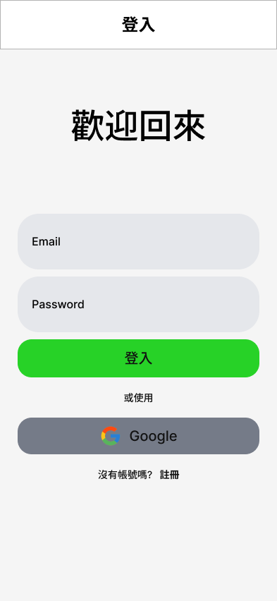
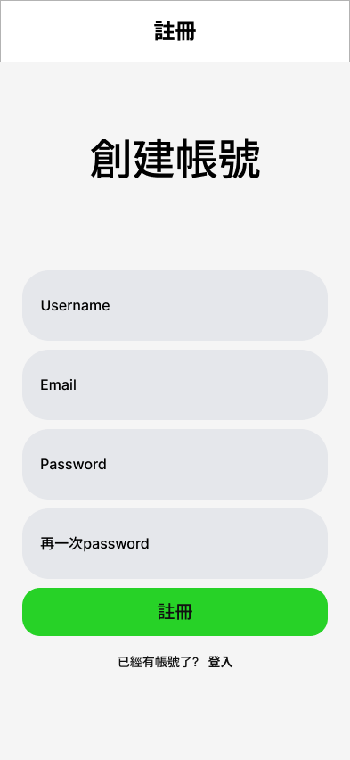
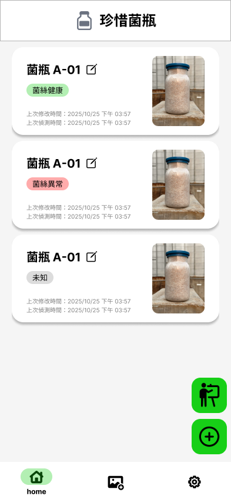
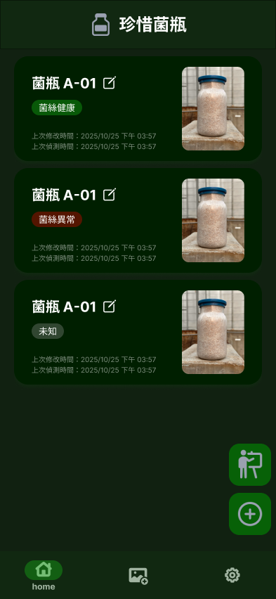
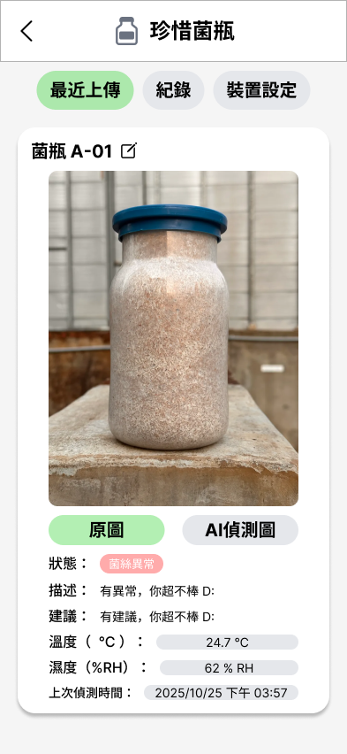
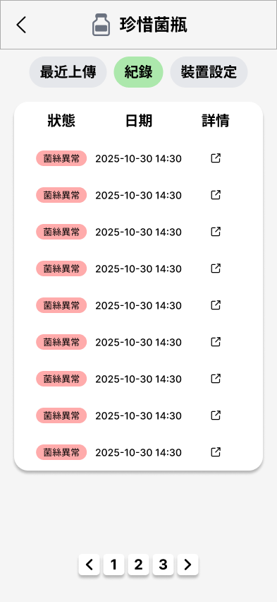
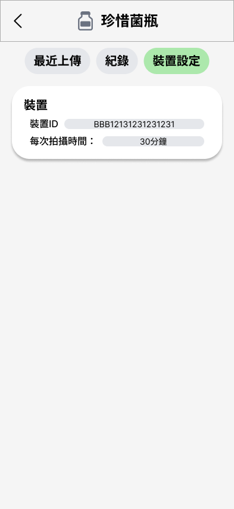
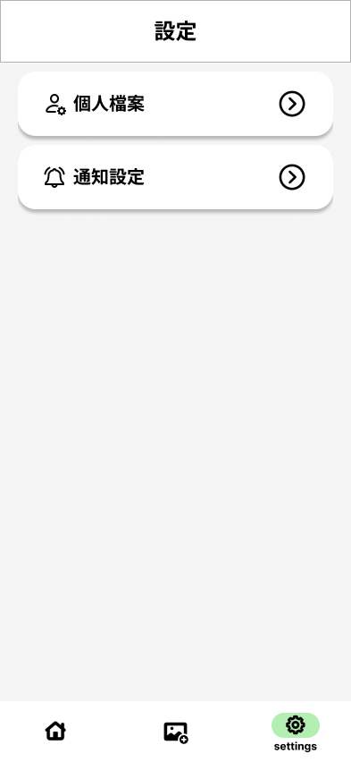
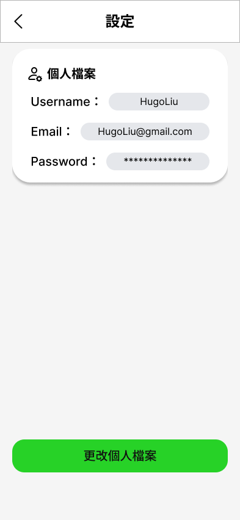
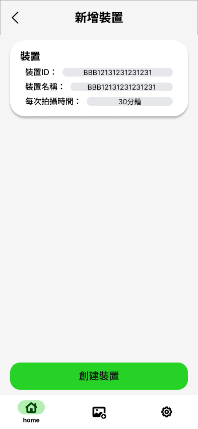

# 珍 · 惜菌瓶 (BioCherish) — App

> 結合 IoT 與 AI 的智慧甲蟲養育監測 App：遠端查看菌瓶外觀與溫濕度，由 AI 判斷是否異常。

這個 repo 是 **前端 App**（React Native + Expo），支援 Android／iOS／Web。後端在另一個 repo，使用 AWS 架設。

## 背景

許多甲蟲飼育者會用瓶裝菌菇（菌瓶）來養幼蟲。菌瓶保存條件嚴格，溫度太高或太低都不行；菌菇一旦變黃、變黑或發霉，也要立刻更換。飼育者常常人不在溫控室旁邊，沒辦法隨時查看。

本系統讓 ESP32-CAM 邊緣裝置定時拍攝菌瓶、量測溫濕度並上傳到雲端，由 AI 模型判斷菌瓶和環境是否異常，再提供建議處置方式。使用者可以在 App 上查看每個菌瓶的狀態和歷史紀錄。

## 畫面

| 登入 | 註冊 | 菌瓶列表 | 菌瓶列表（深色） |
| :---: | :---: | :---: | :---: |
|  |  |  |  |

| 最近一次拍攝 | 歷史紀錄 | 裝置設定 |
| :---: | :---: | :---: |
|  |  |  |

| 設定選項 | 個人檔案 | 新增裝置 |
| :---: | :---: | :---: |
|  |  |  |

## 功能

- **帳號**：Email／密碼註冊與登入、Google OAuth 登入、個人檔案設定
- **菌瓶列表**：一個帳號可以管理多台裝置（多個菌瓶），列表會顯示每個菌瓶的大致狀態
- **菌瓶詳情**：最近一次拍攝結果、依時間區間查詢歷史紀錄、修改裝置名稱與拍攝頻率、手動觸發拍攝、刪除菌瓶
- **新增裝置**：填寫名稱、Wi-Fi 與拍攝頻率，然後下載裝置專屬的韌體（`.bin`）和資源壓縮檔（`.zip`），最後測試連線
- **手動上傳**：在 Uploads 分頁上傳照片（可以附上溫度、濕度）送去辨識
- **深色模式**：跟隨系統的淺色／深色主題

### 尚未完成

- **異常推播通知**：系統規劃在偵測到異常時推播到手機，但 App 還沒有串接推播。通知設定頁（`settings/notifications.tsx`）目前是空白頁。
- **邊緣裝置匯入導覽**：目前只有下載檔案和測試連線，還沒有完整的教學導覽。
- **裝置支援**：邊緣裝置目前只支援 ESP32-CAM，而且只能用來上傳照片。
- **裝置擺放**：位置或角度不正確時，上傳的資料可能不合法，辨識效果會下降。

## 技術棧

- [Expo SDK 54](https://docs.expo.dev/) / React Native 0.81 / React 19 / TypeScript
- [Expo Router](https://docs.expo.dev/router/introduction/)：檔案式路由、typed routes。原生端用 `NativeTabs`，Web 端用一般的 `Tabs`
- [NativeWind](https://www.nativewind.dev/) + Tailwind CSS 3
- axios、expo-secure-store、expo-web-browser、expo-linking
- Lottie（載入動畫）、react-native-reanimated

## 開始開發

### 環境需求

- Node.js LTS
- Android：Android Studio + Android SDK
- iOS：macOS + Xcode
- 只開發 Web 版的話，有 Node.js 就夠了

### 安裝與環境變數

```bash
npm install
```

在專案根目錄建立 `.env`（已列在 `.gitignore`，不會被 commit）：

```env
# 原生端 (Android / iOS) 使用的後端 API 位址
EXPO_PUBLIC_API_URL=https://<your-api-url>
# Web 端使用的後端 API 位址
EXPO_PUBLIC_WEB_API_URL=https://<your-api-url>
```

如果要連本機的後端：

- **Android 模擬器**：用 `http://10.0.2.2:<port>`，不能用 `localhost`，因為模擬器裡的 `localhost` 指向模擬器本身。`app.json` 已經開了 `usesCleartextTraffic`，所以可以用 http。
- **實體手機**：用電腦在區域網路上的 IP，例如 `http://192.168.x.x:<port>`。

### 執行

```bash
npm run android    # expo run:android：在本機做原生建置，再安裝到模擬器或手機
npm run ios        # expo run:ios：同上，需要 Xcode
npm run web        # 在瀏覽器執行
npm start          # 只啟動 dev server（已經裝過 dev build 時使用）
```

`npm run android` 和 `npm run ios` 會產生並建置原生專案（`android/`、`ios/`，都已列在 `.gitignore`）。第一次建置會比較久。

### 程式碼風格

```bash
npm run lint       # ESLint + Prettier 檢查
npm run format     # 自動修正
```

## 專案結構

```
app/                         # Expo Router 路由
├── _layout.tsx              # 根 layout：Theme / SafeArea / Auth Provider，依登入狀態切換 SignIn 或 (tabs)
├── SignIn.tsx / SignUp.tsx
├── SignInSuccess.tsx        # Google OAuth 回呼頁
├── LoadingPage.tsx
└── (tabs)/
    ├── home/
    │   ├── index.tsx        # 菌瓶列表
    │   ├── newEdge/         # 新增裝置：填資料 → 下載韌體 → 測試連線
    │   └── [id]/
    │       ├── _layout.tsx  # 菌瓶詳情的 header（含手動拍攝按鈕）
    │       ├── index.tsx    # 最近一次拍攝 / 歷史紀錄 / 裝置設定
    │       └── history/[detect_record_id].tsx
    ├── uploads/index.tsx    # 手動上傳照片
    └── settings/            # 設定選項、個人檔案、通知設定
components/
├── providers/               # AuthProvider、ThemeProvider、RefreshProvider
└── ...                      # Card、DisplayUpload、HistoryTable、InputsBox、SelectBar、Main、Section 等
constants/theme.ts           # 給 JS 使用的顏色（Tab bar、狀態標籤等）
lib/time.ts                  # 日期格式化
animations/                  # Lottie 動畫
```

## 開發須知

### 登入狀態與 Token

登入狀態由 `components/providers/AuthProviders.tsx` 管理，透過 `useAuth()` 取得。

- **Token 存放**：登入後取得 `access_token` 和 `refresh_token`。原生端存在 `expo-secure-store`，Web 端存在 `localStorage`。
- **帶 token 的方式**：access token 會寫進 `axios.defaults.headers.common['Authorization']`。所以畫面裡直接用全域的 `axios` 發 request 就會自動帶上，不需要自己加 header。
- **過期處理**：axios 的 response 攔截器遇到 `401` 時，會用 refresh token 呼叫 `/auth/refresh` 換新 token，再重送原本的 request。如果換發也失敗，就清掉 token 並登出。
- **畫面切換**：`app/_layout.tsx` 依 `authState.authenticated` 決定顯示 `SignIn` 還是 `(tabs)`。

### Google 登入

1. App 用 `Linking.createURL('/SignInSuccess')` 產生回呼網址（scheme 是 `biocherish`），以 `app_redirect_url` 參數傳給後端的 `/auth/google/login`。
2. 後端回傳 Google 登入網址，App 用 `WebBrowser.openAuthSessionAsync` 開啟。
3. 登入完成後，後端要 redirect 回這個回呼網址，並在 query string 帶上 `access_token` 和 `refresh_token`。

後端必須允許這個回呼網址，否則登入後回不到 App。

### 樣式與深色模式

- 顏色 token 定義在 `tailwind.config.js`。淺色用一般名稱，深色則加上 `Dark` 前綴，寫法例如：
  ```tsx
  <View className="bg-Background dark:bg-DarkBackground">
    <Text className="text-TextColor dark:text-DarkTextColor">…</Text>
  </View>
  ```
- 需要在 JS 裡取得顏色的地方（例如 Tab bar、header），透過 `ThemeContext` 的 `color` 取得。

### API 位址

各畫面用 `Platform.select` 從 `EXPO_PUBLIC_API_URL` 和 `EXPO_PUBLIC_WEB_API_URL` 中選出 API 位址。`AuthProviders.tsx` 也有匯出 `API_URL`。

## 前端依賴的 API

以下是 App 會呼叫的端點，從前端程式碼整理而來，不是完整的後端規格。除了註冊、登入等不需要登入的端點，其他都會帶 `Authorization: Bearer <access_token>`。

| 方法 | 路徑 | 用途 | 呼叫位置 |
| --- | --- | --- | --- |
| POST | `/auth/register` | 註冊 | AuthProviders |
| POST | `/auth/login` | 登入 | AuthProviders |
| GET | `/auth/google/login?app_redirect_url=` | 取得 Google 登入網址 | AuthProviders |
| POST | `/auth/refresh` | 換發 token | AuthProviders |
| POST | `/auth/logout` | 登出 | AuthProviders |
| GET | `/auth/userinfo` | 取得個人資料 | settings/personal |
| POST | `/auth/updateinfo` | 更新個人資料 | settings/personal |
| GET | `/bottle/` | 菌瓶列表 | home |
| GET | `/bottle/{id}` | 最近一次偵測結果 | home/[id] |
| GET | `/bottle/{id}/total` | 偵測紀錄總數 | home/[id] |
| GET | `/bottle/{id}/history?s=&e=` | 指定區間的歷史紀錄 | home/[id] |
| GET | `/bottle/{id}/history/{detect_record_id}` | 單筆偵測紀錄 | home/[id]/history |
| DELETE | `/bottle/{id}` | 刪除菌瓶 | home/[id] |
| POST | `/device/getDevice` | 由 `bottle_id` 取得裝置資訊 | home/[id] |
| PUT | `/device/updateDevice` | 更新裝置名稱與拍攝頻率 | home/[id] |
| POST | `/device/manualScan` | 手動觸發拍攝 | home/[id]/_layout |
| POST | `/device/newDevice` | 建立裝置 | home/newEdge |
| GET | `/device/{deviceId}/bin` | 下載裝置韌體 | home/newEdge/secondPage |
| GET | `/device/{deviceId}/zip` | 下載裝置資源壓縮檔 | home/newEdge/secondPage |
| GET | `/device/{deviceId}/connect` | 測試裝置連線 | home/newEdge/secondPage |
| POST | `/device/manualUpdate` | 手動上傳照片與溫濕度（multipart） | uploads |

## 系統架構（概覽）

```
ESP32-CAM ──MQTT──► AWS IoT Core ─┐
                                  ├─► Lambda ─► DynamoDB / S3（照片）
App（本 repo）──HTTPS──► API Gateway ┘      ▲
                                  EventBridge（定時觸發偵測）
```

後端與資料庫的設計請參考後端 repo，以及專題的功能說明書。

## 邊緣裝置設定流程

1. 在 App 的 Home 分頁新增裝置，填入裝置名稱、Wi-Fi 名稱／密碼與拍攝頻率。
2. 下載 **BIN 韌體檔**，用 [ESPHome Web](https://web.esphome.io/) 燒錄到 ESP32-CAM。
3. 下載 **資源壓縮檔**，解壓縮後用 Arduino IDE 燒入 ESP32。
4. 調整鏡頭角度，讓菌瓶完整入鏡。
5. 回到 App 按「測試裝置連線狀態」，連線成功後就會開始定時偵測。

## 未來展望

- 串接異常推播通知，完成通知設定頁。
- 支援更多種類的邊緣裝置。
- 用其他 AI 模型降低裝置擺放的限制，提高辨識準確度。
- 補齊直觀的裝置匯入導覽，讓不熟悉邊緣裝置的使用者也能快速上手。
- 串接風扇、加濕器、溫控設備等智慧裝置，偵測到溫濕度異常時自動調整環境。
